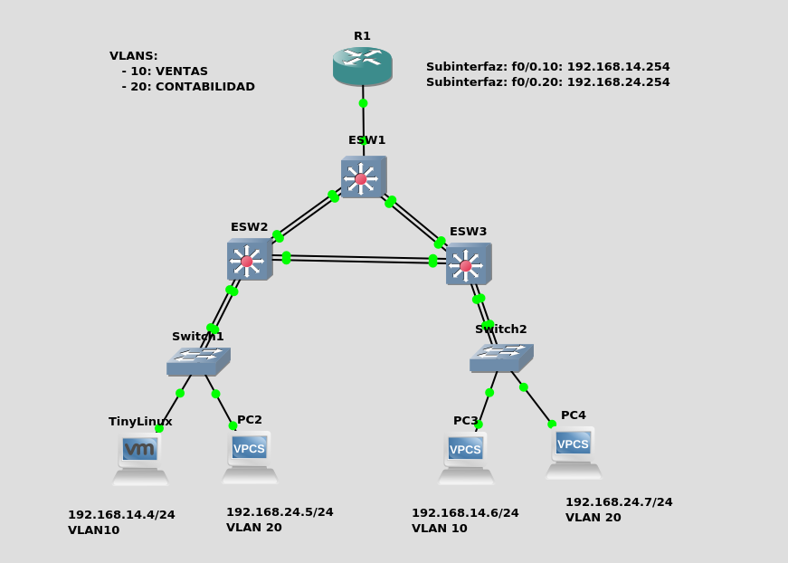
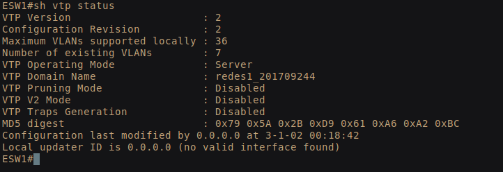
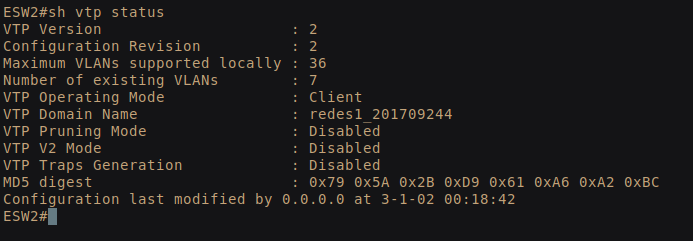
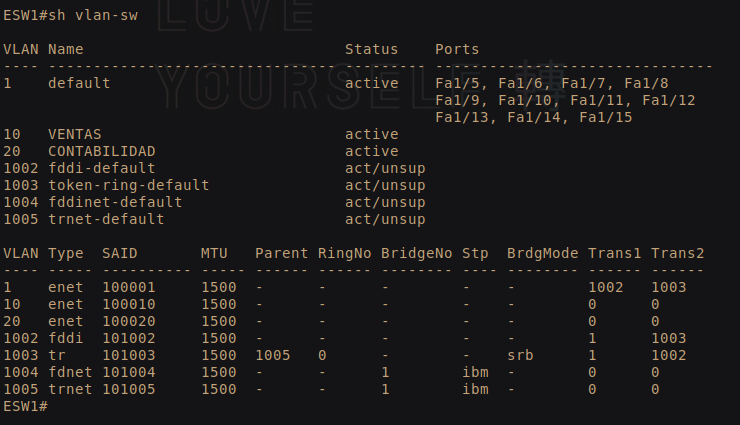
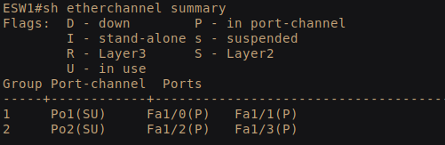
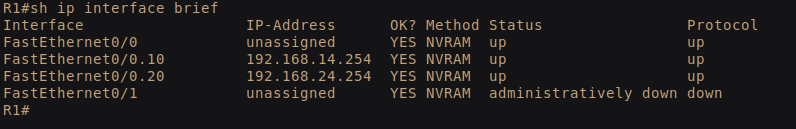
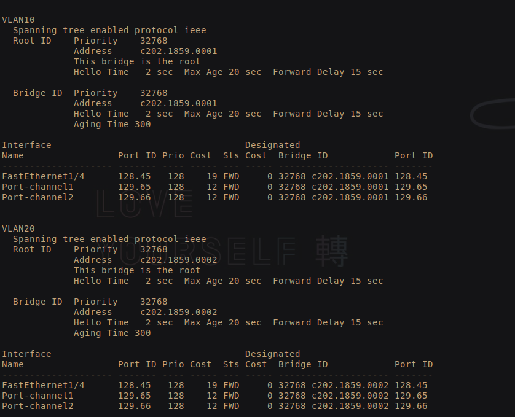
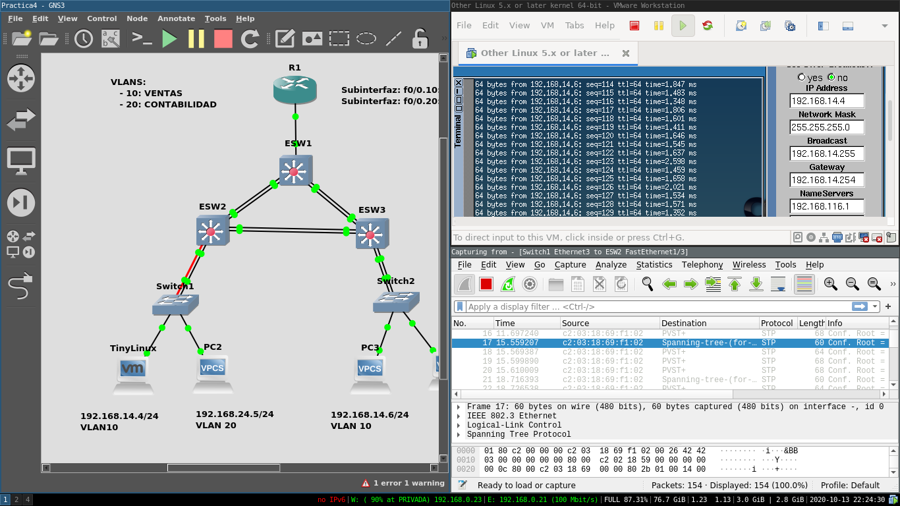

# Redes1-Practica4_201709244

## Definicion de las redes

| VLAN | Direccion de Red | Primera Direccion Asignable | Ultima Direccion Asignable | Direccion de Broadcast |
| ------------- |:-------------:|:-------------:|:-------------:|:-------------:| 
| 10 | 192.168.14.0/24 | 192.168.14.1 | 192.168.14.254 | 192.168.14.255 |
| 20 | 192.168.24.0/24 | 192.168.24.1 | 192.168.24.254 | 192.168.24.255 |

<h2>Topologia a realizar</h2>

## Configuracion

### Configuracion de VTP

#### Comandos:

- conf t
- vtp domain redes1_201709244
- vtp password redes1_201709244
- vtp mode server/client
- end

Si todo salió bien, debería poder revisarse el estatus 
del VTP con el comando: show vtp status

 
 

### Creacion de VLANs 

Las VLANs se crean en el Servidor (en este caso SW1) de la siguiente forma:

- conf t
- vlan {#}
- name {NAME}
- end

Donde # y Name se sustituyen por los numeros y nombres de las VLANs,
en este caso 10,20 - VENTAS, CONTABILIDAD.  
Si todo se hizo de manera correcta, se pueden verificar con el comando
- sh vlan-sw

 

### Configuracion de los port-channel

Los PORT-CHANNEL sirven para agrupar 2 o mas interfaces fisicas de
manera logica, puede hacerse de la siguiente forma:

- conf t
- interfaces range f#/# - #
- channel-group # mode on
- end

Donde f#/# - # Debe sustituirse por un rango de interfaces valido, 
por ejemplo f1/0 - 1. El grupo indica el numero de grupo del puerto
este debe coincidir con el grupo al que se asignan dichas interfaces
del otro lado.

Si todo se hizo bien, es posible revisar las configuraciones de los 
PORT-CHANNEL de cada puerto con el comando: ** show etherchannel summary ** 

 

### Configuracion de las subinterfaces del Router 

Para configurar subinterfaces logicas dentro de una interfaz fisica del 
Router se utilizan los siguientes comandos:

- conf t 
- interface f#/#.#
- ip address IP MASK 
- encapsulation dot1Q #
- end

Donde f#/#.# debe ser sustituido por una direccion de interfaz
valida como f0/0.# El ultimo # se sustituye por un numero a eleccion
del adiministrador. Este identificara dicha subinterfaz de manera unica.
Finalmente, reemplazar el # del comando de encapsulacion, este se refiere
al ID de la VLAN que sera aceptada por la subinterfaz.

Si todo esta bien, La configuracion final de las subinterfaces 
puede revisarse con el comando ** sh ip interface brief **

 

### Verificacion del Switch Root Bridge (STP)

Para encontrar el Switch que actua como Root Bridge basta con 
utilizar el comando sh spanning-tree brief. Este 
comando mostrara todos los puertos actualmente utilizados por la topologia
(FWD) Asi como todos los puertos bloqueados (BLK) Para evitar loops.

Este comando tambien indica la direccion del dispositivo ROOT. Si el 
Switch que utiliza este comando es el Switch Root, Abajo de Address
Se indica claramente que este dispositivo es el bridge root.

 

#### Puertos bloqueados por el STP

Para evitar loops en la topologia, el algoritmo STP bloquea todos los 
puertos que no son necesarios para la comunicacion (redundantes).
Sin embargo, cuando uno de estos puertos se cae,
el algoritmo reactiva uno de estos
puertos bloqueados reparando nuevamente la conexion. 

A continuacion se listan todas las interfaces/port-channels 
y se indica si estan bloqueadas o no.

| ESW | Puerto/Port-Channel | Estado |
| --- |:-------------------:|:------:|
| 1   | FastEthernet1/4     | FWD    | 
| 1   | Port-channel1       | FWD    | 
| 1   | Port-channel2       | FWD    | 
| 2   | FastEthernet1/2     | FWD    | 
| 2   | FastEthernet1/3     | BLK    | 
| 2   | Port-channel1       | FWD    | 
| 2   | Port-channel3       | FWD    | 
| 3   | FastEthernet1/2     | FWD    | 
| 3   | FastEthernet1/3     | BLK    | 
| 3   | Port-channel2       | FWD    | 
| 3   | Port-channel3       | BLK    | 

#### Finalmente, una captura de paquetes entre el ESW2 - SW1
La captura de paquetes demuestra el funcionamiento de la topologia
y el uso del algoritmo STP. Los paquetes capturados pertenecen 
a un ping extendido entre Tiny Linux y un VPC en su misma VLAN.

 
